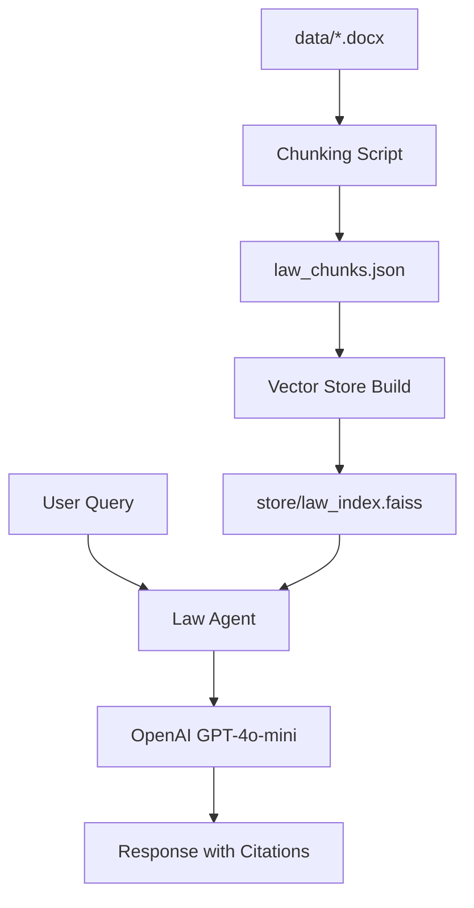

# Giới thiệu Dự án Law Chatbot (RAG System)

Tài liệu này tổng hợp toàn bộ các bước đã thực hiện và giải thích chi tiết luồng xử lý của hệ thống Chatbot Pháp luật Dân sự.

---

## 🏗️ Tổng quan kiến trúc
Hệ thống được xây dựng theo mô hình **RAG (Retrieval-Augmented Generation)**, cho phép AI trả lời dựa trên những tài liệu pháp luật cụ thể thay vì chỉ dựa vào kiến thức có sẵn.

### Quy trình tổng quát:

---

## 🛠️ Các giai đoạn phát triển

### 1. Giai đoạn Parse tài liệu (Data Ingestion)
- **File xử lý**: `src/chunking.py`
- **Thư mục đầu vào**: `data/` (Chứa các file .docx của các bộ luật khác nhau).
- **Nhiệm vụ**: Đọc toàn bộ file Word trong thư mục và bóc tách cấu trúc pháp luật Việt Nam (Chương > Mục > Điều > Khoản).
- **Kết quả**: 
    - `law_structured.json`: Cấu trúc cây phục vụ quản lý.
    - `law_chunks.json`: Danh sách các đoạn văn bản (1.673 đoạn) đã được gán nhãn metadata để phục vụ embedding.

### 2. Giai đoạn Xây dựng Vector Store (Indexing)
- **File xử lý**: `src/store.py`, `src/build_store.py`(Chạy file này để khởi tạo cơ sở dữ liệu vector. Nó dùng store.py và law_chunks.json để tạo ra kho dữ liệu tìm kiếm.)
- **Công nghệ**: `sentence-transformers` (model: `paraphrase-multilingual-MiniLM-L12-v2`) và `FAISS`.
- **Luồng code**:
    1. Load các đoạn văn bản từ `law_chunks.json`.
    2. Chuyển đổi văn bản thành các vector số học (Embeddings).
    3. Lưu trữ các vector vào index của FAISS để tìm kiếm cực nhanh.
- **Kết quả**: Thư mục `store/` chứa file index và metadata.

### 3. Giai đoạn RAG Agent & Tích hợp LLM
- **File xử lý**: `src/agent.py`
- **Công nghệ**: OpenAI API (`gpt-4o-mini`).
- **Cơ chế hoạt động (Search & Answer)**:
    1. Nhận câu hỏi từ người dùng.
    2. Sử dụng `LawVectorStore` để tìm ra Top 5 đoạn luật liên quan nhất.
    3. Trộn (Augment) câu hỏi của người dùng với 5 đoạn luật đó thành một Prompt gửi lên OpenAI.
    4. Yêu cầu AI chỉ trả lời dựa trên context đó và luôn phải trích dẫn Điều/Chương cụ thể.

### 4. Giao diện thực thi (UI)
- **File xử lý**: `src/main.py`
- **Nhiệm vụ**: Cung cấp giao diện dòng lệnh (CLI) để người dùng trò chuyện trực tiếp với Agent. Quản lý việc load cấu hình từ file `.env`.

---

## 📂 Danh sách file quan trọng
- `src/chunking.py`: Trình phân tích văn bản luật (hỗ trợ nhiều file cùng lúc).
- `data/`: Thư mục chứa các file luật (.docx).
- `src/store.py`: Quản lý Vector Store và Embedding.
- `src/build_store.py`: Script khởi tạo cơ sở dữ liệu vector.
- `src/agent.py`: Trí thông minh của chatbot (RAG logic).
- `src/main.py`: Điểm bắt đầu của ứng dụng.
- `.env`: Lưu trữ API Key và các cấu hình bảo mật.

---

## 🚀 Cách hệ thống trả lời "Điều 8"
Khi bạn hỏi về trách nhiệm dân sự, Agent sẽ:
1. Tìm trong FAISS thấy vector của Điều 87 có độ tương đồng cao nhất.
2. Lấy nội dung Điều 87 dán vào câu lệnh gửi lên GPT.
3. GPT đọc nội dung đó và viết lại thành câu trả lời dễ hiểu cho bạn, đồng thời ghi chú: *"Theo Điều 87 của Bộ luật Dân sự..."*
